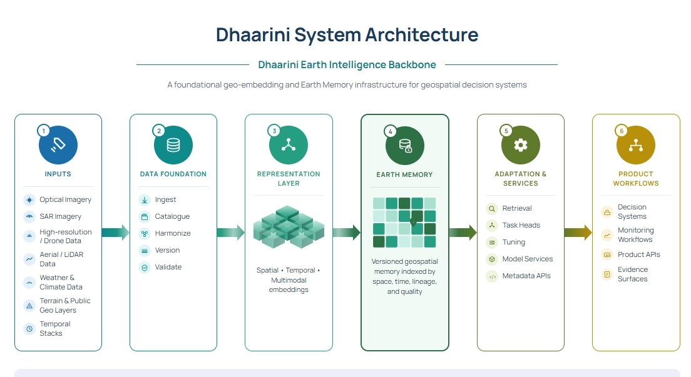

# My approach to SatSure’s Dhaarini Project

[Me→ Dhruva Myakeri, looking into Dhaarini docs and documenting my thoughts here](Me%E2%86%92%20Dhruva%20Myakeri,%20looking%20into%20Dhaarini%20docs%20and%203b5a49fe97ae8040b950eae3315704ad.md)

## Introduction (**The informal pure thoughts blog where its just me reading the white paper thinking is on top too)**

This is an independent write-up documenting my process of engaging with SatSure's Dhaarini white paper: reading it, picking up the geospatial data science fundamentals needed to actually reason about it, and then running a small, self-contained experiment to stress-test its central architectural bets on real data.

This wasn't commissioned. I read the white paper, found the core thesis (that a label-free representation of Earth, learned once, can be reused cheaply across tasks and geographies) interesting and testable, and wanted to see how much of it would actually hold up on real Indian agricultural imagery at a scale I could run on my own.

The blog is in three parts: first, my reading of what Dhaarini is trying to solve and why; second, the geospatial data science fundamentals I had to learn to make sense of any of this (satellite bands, reflectance, spectral indices, CRS, optical vs SAR); and third, the actual experiment, building a data pipeline from the AgriFieldNet India dataset, training supervised baselines, training a label-free encoder (MAE, then JEPA), and testing whether the resulting representation actually transfers across geography, the way the white paper's core bet requires it to.

Worth being upfront about scope. This isn't a build of Dhaarini, and it
doesn't touch every layer in the white paper. I tested what I could run
solo, on a public dataset, with CPU-scale compute, on the layers I found
most interesting and most testable.So this is a stress test of two specific bets (reuse and transfer) on one layer of a much bigger architecture, not a report card on Dhaarini as a
whole. I'd rather say that plainly than let the results imply more coverage
than they have.

---

---

---

---

---

---

So I have read the dhaarini docs and have got some understanding , which was somewhat recorded in that informal blog.

This blog now also includes me learning the fundamentals on Geospatial Data Science etc

**→the problem dhaarini attacks**

Conventional geospatial AI is task-specific, every new problem triggers new data, labels, model , benchmark, etc(deployment …)

This produces outputs but never accumulates reusable intelligence underneath them. As a company expands across sectors, this repeated assembly becomes the bottleneck, it relearns Earth from scratch each time.

→what dhaarini is

Dhaarini isn't a single "earth model" you feed an image and get an answer back
from. It's what the white paper calls an **Earth Intelligence Backbone** — a
layered system built around one shared representation of Earth, with
everything else (memory, adaptation, APIs, governance) organized around that
representation.

The layers:



## The two central bets (which this project tests)

- **Reuse:** a representation learned once (ideally without labels) can be adapted
cheaply to many downstream tasks.
- **Transfer:** that reused representation holds across geographies and tasks,
the risky assumption, because geospatial data is **non-stationary** (the same
crop looks different across soil, climate, and season).

---

# Part 2: Geospatial data-science basics

Everything needed to understand how satellite imagery is read and prepared. None
of this is standard ML background, so it is spelled out.

## A satellite image is not a photo

A normal photo is `(Height, Width, 3)`: red, green, blue. A satellite image is a
**stack of spectral bands**, `(Bands, Height, Width)`: channels first. Each band
measures how much light of a specific wavelength reflected off the ground. Our data
has **12 bands**.


## Reflectance, not brightness

Pixel values are not 0–255 colours. They are **reflectance**, the fraction of
incoming light reflected, usually stored as scaled integers. Never assume the
scale; measure the actual value range of any new dataset before normalizing.

## The invisible bands carry the signal

Healthy vegetation absorbs red light (for photosynthesis) and strongly reflects
**near-infrared (NIR)**. That NIR/red contrast is the most informative feature for
agriculture and is completely invisible to the human eye. This is why "just use
RGB" throws away most of the value.

## Spectral indices

Simple ratios of bands that summarize physical properties:

- **NDVI** = (NIR − Red) / (NIR + Red), vegetation vigour. Range −1 to +1; bare
soil/water near 0, dense healthy crops toward 0.7–0.9.
- **NDWI** = (Green − NIR) / (Green + NIR), water/moisture.
- **NDBI** = (SWIR1 − NIR) / (SWIR1 + NIR), built-up/bare ground.

A random forest on a few good indices is already a respectable classifier.

## Resolution

Each pixel covers a fixed ground distance. Our bands are natively 10 m, 20 m, or
60 m per pixel, resampled to a common 10 m grid. **Resolution can be derived from
metadata:** for a chip with bounds spanning 2560 m over 256 pixels,
2560 / 256 = 10 m/pixel.

## Coordinate Reference Systems (CRS) and projections

A CRS is the mathematical definition of how pixel positions map to real locations
on the curved Earth. Our chips use **UTM** projections. UTM coordinates are in **metres**, which is why
resolution falls out of the bounds directly. Mismatched CRSs between two layers are the classic silent bug: layers that look aligned but are physically offset.
Converting a UTM coordinate to latitude/longitude (WGS84, EPSG:4326) is a
**reprojection**.

## Optical vs SAR

- **Optical** (our data, Sentinel-2): a multi-spectral camera. Sees reflected
sunlight. **Clouds block it**, hence cloud-free composites.
- **SAR** (radar, e.g. Sentinel-1): active radar, complex-valued, sees through
clouds day or night. Fundamentally different physics (backscatter, phase,
speckle). Not used here, but part of what Dhaarini fuses.

## Tools used

- **rasterio / GDAL**: read GeoTIFF rasters, access metadata (bands, dtype, CRS,
bounds).
- **rasterio.warp.transform**: reproject coordinates between CRSs.
- **numpy**: array handling; bands stacked into `(12, H, W)`.
- **boto3**: pull data from an S3-compatible public bucket.

## Common data-reading pitfalls (all hit in this project)

- **uint16 underflow:** subtracting unsigned integers wraps negatives to huge
positives. Cast to float *before* subtracting (e.g. for NDVI).
- **Band ordering:** `B8A` sorts after `B12` alphabetically, so relying on
sort/glob order silently scrambles channels. Order bands explicitly.
- **File-type confusion:** several `.tif` files per chip look identical; the
**value range** identifies them (0–36 = crop labels, thousands = field IDs,
reflectance = imagery), not the filename.
- **Per-image vs global normalization:** normalize with statistics computed across
the whole dataset, not per patch, or identical crops under different lighting get
mapped differently.

---

# Part 3: The dataset

**AgriFieldNet India Competition Dataset** (Radiant Earth, via Source Cooperative).

| Property | Value |
| --- | --- |
| Imagery | Sentinel-2, optical, single-date |
| States | Uttar Pradesh, Rajasthan, Odisha, Bihar |
| Usable chips | ~1,165 (image + train label) |
| Chip size | 256 x 256 px @ 10 m = 2.56 km x 2.56 km |
| Bands | 12 (B01–B12 incl. B8A), uint16, separate single-band tifs |
| Longitude range | 76.26°E (west) to 88.03°E (east) |
| Labels | Per-pixel crop type (segmentation), 13 classes |
| Label density | **0.256%** of pixels labelled crop; 99.74% background |

### Classes

`0` Background, `1` Wheat, `2` Mustard, `3` Lentil, `4` Green pea, `5` Sugarcane,
`6` Garlic, `8` Maize, `9` Gram, `13` Coriander, `14` Potato, `15` Berseem,
`16` Rice, `36` Fallow.

### Key data properties (measured)

```
Total pixels     : 3,735,552   (over 57 chips)
Non-zero (crop)  : 9,575  (0.256% of all pixels)
Per class: class 1: 3,087 | class 2: 3,264 | class 16: only 14 pixels | ...
```

Two facts dominate everything downstream: **extreme label sparsity** (0.256%) and
**severe class imbalance** (some crops have thousands of pixels, others 14).

**→Building the data foundation**

Goal: turn raw `.tif` files into verified `(image, label)` pairs.

### Reading a chip

`rasterio.open()` gives metadata and pixels. First read confirmed the format:

```
Band count : 1
Size (H,W) : 256 256
Dtype : uint16
CRS : EPSG:32645
Bounds : BoundingBox(left=589600.0, bottom=2833920.0, right=592160.0, top=2836480.0)
Value range: 0 to 6642
```

(This was a `field_ids` file: the 0–6642 range gives it away, not the filename.)

### Assembling 12 bands

Each chip stores 12 single-band files (`..._B01_10m.tif` … `..._B12_10m.tif`).
`load_chip` opens them **in explicit physical order** and stacks to `(12, 256, 256)`.
Per-band ranges on one chip:

```
Chip shape: (12, 256, 256)
B01: 44-48   B02: 35-47   B03: 29-45   B04: 22-48
B05: 24-51   B06: 28-67   B07: 31-90   B08: 26-86
B8A: 29-97   B09: 7-17    B11: 11-96   B12: 7-89
```

The rising staircase from visible (B02–B04) to NIR (B07–B8A) is the vegetation
signature. B09 (water vapour) is flattest: low information.

### Global normalization

Streamed over all chips to compute per-band mean/std (using running sums of `x`
and `x²`; variance = E[x²] − E[x]²), saved to `band_stats.npz`. Full-dataset
result:

```
Per-band mean: [43.33 38.76 37.69 39.6 42.69 55.08 63.77 60.4 70.24 13.2 69.52 48.5]
Per-band std : [3.38 4.22 5.66 9.81 8.51 6.8 8.13 7.79 9.15 2.37 17.75 16.45]
```

### Pairing images with labels

Chips matched by ID; only chips with both an image and a label kept:

```
Image chips: 59 | Crop labels: 1165 | Usable pairs: 57
```

Two orphan chips (image but no label) were legitimate test-split chips and dropped.

### Patch labelling: the sparsity problem

Naive approach: cut 16x16 patches, label by the majority pixel. Result:

```
8 patches | 2 classes: [1, 2]
```

Only 8 usable patches, because a 16x16 patch is "majority crop" only if it lands
almost entirely inside a labelled field, nearly impossible at 0.256% density.

**Fix: center-pixel labelling:** slide a 16x16 window with stride 4; keep a patch
only if its **center pixel** is a labelled crop; label it by that pixel. Result:

```
540 patches | 12 classes  (on 57 chips)
10694 patches | 13 classes  (on full ~1165 chips)
```

### Splits

- **In-distribution:** chip-level random split, 20% test, seed 42. Splitting by
**chip** not patch prevents spatial leakage (overlapping patches from one field
landing in both train and test).
    
    ```
    Chips  -> train 837, test 209
    Patches-> train 8530, test 2164
    ```
    
- **Rare-class filter:** drop classes with < 40 train patches:
    
    ```
    Sugarcane (20) drop, Rice (12) drop -> 11 classes kept
    Train: 8498 patches | Test: 2155 patches
    ```
    

**MODELLING:**

## Baselines (why?)

A baseline is a deliberately simple model built first so later, sophisticated
models can be judged against it. Here they also serve the thesis directly: the
supervised baseline is the "trained the expensive way" reference that the
self-supervised embedding must match to prove the reuse bet.

## Self-supervised learning: why

Labels are the scarce resource (0.256% of pixels). Self-supervised learning trains
a model on the imagery **without labels**, by hiding part of the input and having
the model predict the missing part. To do this it must learn the structure of
farmland. The learned **encoder** is then a reusable representation.

## Masked Autoencoder (MAE)

Mask a fraction of the patch, encode the visible part to an embedding, decode back
to reconstruct the full patch, and compute loss (MSE) on the **masked** pixels only,
so the model cannot cheat by copying visible input. After training, keep the
encoder, discard the decoder. Lineage: He et al. 2021 (MAE), Cong et al. 2022
(SatMAE, the multi-spectral satellite adaptation).

## JEPA (Joint-Embedding Predictive Architecture)

Instead of reconstructing pixels, predict the **embedding** of the masked content
in latent space. A **target encoder** (an EMA, exponential moving average, copy of
the main encoder, updated without gradients) produces the target; a predictor maps
the context embedding to it. Because it predicts representations, not pixels, it is
pressured toward semantic structure and away from surface noise. Lineage: I-JEPA
(Assran et al. 2023); the text version is the author's prior work. The version here
is simplified: it predicts the global patch representation rather than
spatially-located target blocks, adapted to the 16x16 scale.

## Dimensional collapse and VICReg

Self-supervised embeddings can **collapse**: the model routes information through
very few dimensions, wasting the space. Measured by **effective rank** (from the
eigenvalue spectrum of the embedding covariance; low = collapsed, near full = healthy).
**VICReg** regularizes against this with two terms:

- **Variance:** push each dimension to have spread ≥ a target (keeps dims alive).
- **Covariance:** push off-diagonal covariances toward zero (keeps dims distinct /
decorrelated).
Variance alone controls per-dimension spread but not redundancy; covariance is what
prevents rank collapse.

## Linear probing: the reuse test

Freeze the self-supervised encoder (weights locked, no gradients). Embed each
labelled patch. Train **only a single linear layer** (`128 → 11`) on the labels.
Because the probe has almost no capacity, any classification skill must come from
the embedding already organizing the classes. If it works, the label-free
representation is genuinely reusable.

## Transfer test

Train the probe on one geographic region and evaluate on a held-out region. The
drop versus in-distribution performance is the **non-stationarity / transfer cost**:
the risky part of Dhaarini's thesis, quantified.

## Earth Memory

Store every patch's embedding + metadata, and search by cosine similarity ("find
farmland like this"). Retrieval quality is measured by the nearest-neighbour
**same-crop rate** vs a random baseline.

## Stage 2: Baselines (done)

### Baselines (trained with labels)

The "expensive way, with labels" reference the reuse bet has to match.

- Random forest on spectral features: **macro-F1 0.232**
- Small CNN, end to end: **macro-F1 0.240**

Side finding: wheat and mustard get confused in both models. They're both winter rabi crops with overlapping timing, so on single-date optical they look almost identical. Two different methods making the same mistake means it's the data, not the model.

Deliberately simple models to set the bar the embedding must beat. Split is
**by chip, not by patch**, to prevent spatial leakage (seed=42, 20% test).

Full-data split: **837 train / 209 test chips → 8,530 / 2,164 patches, 13 classes.**

### Baseline A: Random Forest on spectral features

Per-patch: 12 band means + NDVI/NDWI/NDBI (15 features). Discards all spatial
layout on purpose: tests how far pure spectral average gets you.

- **Macro-F1 0.197**, accuracy **0.55**.

### Baseline B: Small CNN (12→32→64 conv, global pool, linear)

Uses spatial texture the RF throws away. On CPU, 30 epochs.

- **Macro-F1 0.186**, accuracy 0.32. Train loss barely moved → **underfitting**,
has headroom.

### Findings (the reportable part)

- **Quality tracks sample count.** Only the 3–4 populous classes (Fallow, Wheat,
Lentil, and one distinctive crop) are learnable; the ~10 rare classes score ~0.
- **Macro-F1 fell vs the 57-chip run (0.35→0.20) even though accuracy rose**,
because the full test set now includes rare classes scoring 0. The honest,
complete problem is harder than the flattering subset. Imbalance dominates.
- **RF vs CNN = different failure modes, not a clean winner.** RF is a
conservative majority-guesser (dumps into big classes, safe precision); the CNN
takes risks and actually engages rare classes (higher recall, lower precision).
- **Single-date limitation is visible:** two crops are heavily confused in *both*
models: evidence that same-date spectra can't separate similarly-timed crops.
Motivates Dhaarini's "time is a first-class dimension" claim.

### Next housekeeping

- Filter ultra-rare classes (`MIN_TRAIN_PATCHES = 40`) for a fair comparison;
report the dropped ones as "insufficient data". (`filter_split.py`)
- Attach crop names to all outputs (`CLASS_NAMES`) so confusion matrices read in
real crops.

---

## Project structure

```
config.py            # single source of truth: paths, patch/stride, seed, class names
download_all.py      # pull full dataset (resumable)
compute_stats.py     # global band mean/std -> band_stats.npz
dataset.py            # AgriFieldPatches (center-pixel labelling)
baseline_split.py    # chip-level train/test split -> split.npz
filter_split.py      # drop rare classes -> split_filtered.npz
baseline_rf.py        # Random Forest baseline
baseline_cnn.py      # small CNN baseline
```

Everything reads from `config.py`, so scaling from 57 → 1,165 chips needed only a
data path + stats recompute, no code changes.

---

## Stage 3: Self-supervised geo-embedding (done)

A masked autoencoder (SatMAE / He-et-al. lineage), trained with **no labels** to
reconstruct hidden pixels from visible ones, forcing it to learn farmland
structure. Encoder → 128-dim embedding; decoder reconstructs the patch.

- `extract_patches.py`: pulls **60,000** patches from the 837 train chips (no
label needed, so ~7× more data than the 8.5k labelled baseline patches).
Saved to `pretrain_patches.npy`. This is the concrete payoff of self-supervision
on a sparse-label dataset.
- `mae.py`: trains the MAE, saves the frozen encoder to `mae_encoder.pt`,
reports embedding **effective rank** as a collapse check.

### The dimensional-collapse episode (the key finding)

- Plain MAE → effective rank **21/128** (thin: reconstruction needs few factors,
so the embedding under-used its space).
- First fix attempt (variance term only) → **collapsed to rank 1.2/128** while the
variance loss read 0.0000. Diagnosis: this was a **covariance/redundancy**
failure, not a variance one; all dims were correlated (individually spread,
collectively rank-1). Variance regularization alone can't see this.
- Correct fix: full **VICReg** (variance **+ covariance** terms). Covariance
decorrelates dimensions → effective rank **62/128** (healthy). `cov` loss fell
3.6 → 1.6 across training, confirming the mechanism.
- Cost: recon loss rose 0.059 → 0.14: capacity traded from reconstruction to a
distributed embedding. Correct trade: a rich embedding that reconstructs a bit
worse transfers better than a thin one that reconstructs well.
- Tuning note: with covariance active, VAR_WEIGHT 25 vs 30 gave rank 62 vs 63:
variance was no longer the binding constraint.

> This is a real instance of the "shared embedding collapses" failure mode:
hit it, diagnosed the specific cause (redundancy, not low variance), fixed it
with the right regularizer. Directly on-thesis for the transfer critique.
> 

---

## Stage 4: Reuse test (done)

Freeze the label-free encoder, embed every labelled patch, train **only a single
linear layer** on top, evaluate on the same filtered 11-class test split.

- `probe.py`: loads frozen `mae_encoder.pt`, precomputes embeddings, trains an
`nn.Linear(128 → 11)`, reports macro-F1 vs baselines.

### Result

| Model | Labels used for representation | Adapter | Macro-F1 |
| --- | --- | --- | --- |
| Random Forest | full | RF on features | 0.232 |
| Small CNN | full | end-to-end | 0.240 |
| **MAE + linear probe** | **none** | **1 linear layer** | **0.224** |

**The reuse thesis essentially holds.** A linear probe on a representation
learned with **zero labels** landed within ~0.02 of models trained end-to-end
*with* labels, i.e. "learn Earth once (no labels), adapt cheaply (linear head)"
works on Indian farmland. Notes:

- The probe engages hard classes (Garlic 0.61 F1, Green pea 0.52) like the CNN,
not just the majority classes.
- Wheat↔Mustard confusion persists in all three models → the ceiling is the
**single-date data**, not the method (two rabi crops, overlapping phenology).
- The MAE is undertrained (40 epochs, recon still falling) → clear headroom to
*beat* the baselines by training longer/bigger, or via a JEPA variant.

---

## Stage 6: Transfer stress test (done, THE HEADLINE RESULT)

Split chips **geographically** by longitude (west < 82.2°E = train, east ≥ = test)
instead of randomly, using each chip's CRS reprojected to lat/lon. West ≈
Rajasthan/western UP (drier); east ≈ Bihar/Odisha. Same frozen MAE encoder, same
linear probe.

`region_split.py` (per-chip longitude) → `probe_transfer.py` (geographic probe).

### Result

| Split | Macro-F1 |
| --- | --- |
| In-distribution (random, regions mixed) | **0.224** |
| Cross-region (train West → test East), all classes | **0.048** |
| Cross-region, **shared classes only** (removes distribution-shift artifact) | **0.054** |

**~76% of performance lost when crossing regions, and it persists after
restricting to crops present in BOTH regions.** So the collapse is genuine
*representation*-transfer failure, not just a missing-class artifact. This is
non-stationarity quantified: the exact risk raised in the Dhaarini write-up,
measured on real Indian data. The reuse bet that *held* in-distribution *breaks*
across geography.

### Why it collapsed (two mechanisms, both real)

1. **Class distribution shifts:** Fallow (class 10) is essentially test-only
(common in the east, near-absent in the west), so the probe never learned it
(0.00 F1). The label distribution itself is non-stationary across regions.
2. **Representation doesn't transfer even for shared crops:** Green pea 0.52→0.14,
Garlic 0.61→0.10. These grow in *both* regions, yet still failed in the east:
the same crop *looks different* in eastern soil/climate/season than the
embedding learned in the west. This is the "overfits to the dominant region"
failure predicted in the write-up.

### Caveat (for rigour)

Part of the drop is the class-shift artifact (test-only + tiny-support classes).
A cleaner number restricts to classes present in *both* regions to isolate pure
representation-transfer from distribution-shift. TODO before quoting formally.

## Stage 3b: JEPA variant (done)

### Why JEPA (my approach)

so an MAE is scored on reconstructing pixels, so to get the MSE low it has to model everything in the patch, even the region specific surface details, which doesnt transfer.

hence having knowledge on JEPA, i knew it would remove this pressure. it predicts the embedding of the masked content, not the pixels.

it only needs to get the representation right, hence it is pushed towards the important structure and away from the surface noise. henceee, if this theory would hold that would mean, this would become a transferrable representation.

so i ran both, same backbone, only the objective changed:

|  | In-distribution | Transfer (W to E) |
| --- | --- | --- |
| MAE (pixel) | 0.224 | 0.054 |
| JEPA (latent) | 0.217 | **0.079** |

so thats what kinda did happen, the in distribution was almost a tie, JEPA gave 0.217 and mae had given 0.224, but the transfer, JEPA gave 0.079 and MAE gave 0.054, so the advantage appeared precisely where i assumed it would. in distribution there is no penalty for encoding region specific stuff since train and test share regions, so both should tie, and they did. a random improvement would have moved both numbers.

the encoder did pretrain on all regions though, only the probe was west only, so its not really a data coverage thing, there are some probable reasons, but for now i had to test out if my assumptions and approaches would do something, and i believe JEPA would be an approach dhaarini could adopt, though i couldnt demonstrate it completely, the theory around JEPA is what makes me say that.

## Stage 5: Earth Memory (done)

Index every patch as a stored embedding (JEPA) + metadata (crop, chip,
longitude); search by cosine similarity: "find farmland like this."
`earth_memory.py`.

### Retrieval works

- **Nearest-neighbour same-crop rate: 82.4%** (random baseline ~9%). The space is
organized by agricultural meaning *without ever being told about crops*: the
Earth Memory thesis, validated. Analog discovery works.
- Retrieval "errors" are the same **Wheat↔Mustard** confusion seen in every other
stage: a completely different method (retrieval, not classification)
independently confirms these crops are entangled on single-date optical.

### A subtle, important observation

Some queries return neighbours at the *identical longitude* with sim ~0.998:
the embedding partly encodes **scene/location**, not purely crop. This is the same
fact as the transfer collapse, seen from another angle: a location-entangled
embedding is exactly one that fails to generalize across regions. Retrieval
success and transfer failure are two views of one underlying property.

### The versioning problem: demonstrated

- Same-encoder best match (JEPA→JEPA): sim **0.982**.
- Cross-encoder (JEPA query → MAE memory): sim **0.523** (near-garbage).
- Different encoders learn different coordinate systems → **memory built with one
encoder is meaningless to another.** Improve the encoder and the whole stored
archive must be re-embedded. This is the Earth Memory lifecycle risk from the
white paper, made concrete on real data.

---

1. **Reuse works in-distribution:** self-supervised embedding + linear probe
(0.224) matches supervised baselines (RF 0.232, CNN 0.240) using **no labels**.
2. **Reuse breaks across regions:** same embedding collapses to 0.054 W→E
(~76% loss), persisting after removing class-distribution artifacts:
non-stationarity, quantified.
3. **A better objective helps transfer:** JEPA (latent) beats MAE (pixel) by +46%
on transfer while tying in-distribution: a specific, theory-driven result.
4. **Earth Memory works and has a lifecycle cost:** embedding retrieval hits 82%
same-crop (vs 9% random); swapping encoders strands the stored memory
(0.98→0.52 similarity): the versioning problem, demonstrated.

This is the empirical version of the argument made to SatSure: the reuse bet is
real, the transfer risk is real and severe, and the pretraining objective is one
lever that measurably reduces it.

All of this ran on 57–1,165 chips and CPU-scale compute over a few days of solo iteration: with real data budgets and real compute, I'd expect every number here (reuse, transfer, JEPA's edge, retrieval quality) to move further in the direction the thesis predicts, not away from it.